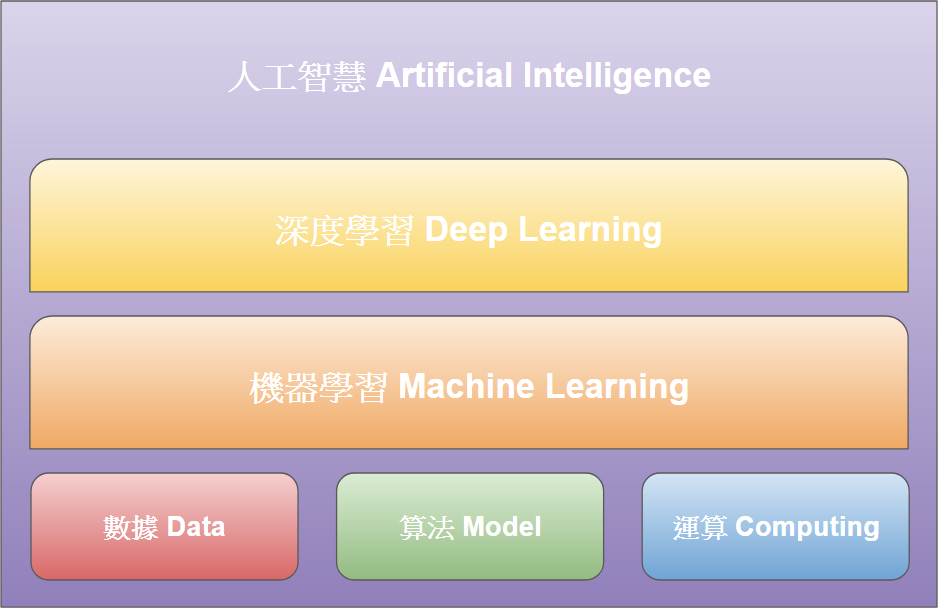

# AI介紹
一般稱的 AI 其實是 Artificial Intelligence 的縮寫，而這個名字也清楚地表達了它的涵義。人工智慧的定義其實就是以「人工」編寫的電腦程式，去模擬出人類的「智慧」行為，其中包含模擬人類感官的「聽音辨讀、視覺辨識」、大腦的「推理決策、理解學習」、動作類的「移動、動作控制」等行為。

## 人工智慧今天與未來面向
傳統人工智慧方法講究探討人類的知識、推理以及感官結構， 目的在於創造人類一般的「通用人工智慧」（Artificial General Intelligence） ，可以透過知識彙整和推理學習全新的知識、全新的語言，甚至全新的推理方式。

當人工智慧產業為了實用性考量而改以機器學習為理論基礎時，我們整體產業已決定用精準度和實用性去取代人工智慧的科學性。

今日人稱「人工智慧」的機器學習，跟傳統人工智慧方法有幾種根本性差異：首先，機器學習方法需要大量的資料；第二，這些資料的採集、篩選以及處理，都仰賴良好的變數選擇（Variable Selection）；第三，機器學習方法的輸入以及輸出結果之間的關係是建立於統計關係，而非邏輯與語義關係；第四，機器學習方法的結果的意義來自於設計者賦予的意義，而非模型結構本身。

打個比方，現在業界常常炒作的「深度學習」（Deep Learning），就是很典型的機器學習方法。簡單而言，深度學習的理論基礎很單純，基本上就是「人工神經網路」，用許多可以處理輸入的資訊處理單位（學術上稱神經元Perceptron）來組成一網路，然後再用多層網路來做出理想的統計分布。故此，深度學習需要的資料量可能是目前所有機器學習方法最大的；第二，在進行深度學習之間，設計者必須先定義和選擇合適的變數來做學習；第三，神經元、網路的輸出結果的標準在於統計分布符合設計者的期許，並沒有天生的邏輯或與語言上的意義；第四，深度學習的方法本身並非專注於教育、自然語言、機器人、工業4.0等領域，其實用上的意義是由設計者定義的。

事實而言，最近十年來人工智慧產業的突破都要歸功於機器學習。 但是，許多關於人工智慧可能將發展成擁有自由意識的終結者之輿論，基本上都不會成真。因為不單單是現今機器學習方法與人類智慧的純理論研究漸行漸遠，關於自由意識、情感、自我等觀念，仍停留在哲學與心理學的純理論階段，目前不但學術界與業界沒有工程化的趨向，說穿了也沒有這方面的興趣。

## 參考資料
[AI來襲！三分鐘看懂人工智慧](https://makerpro.cc/2019/05/introduction-to-ai/) 

[人工智慧到底在幹嘛？](https://www.bnext.com.tw/article/42632/what-is-ai)