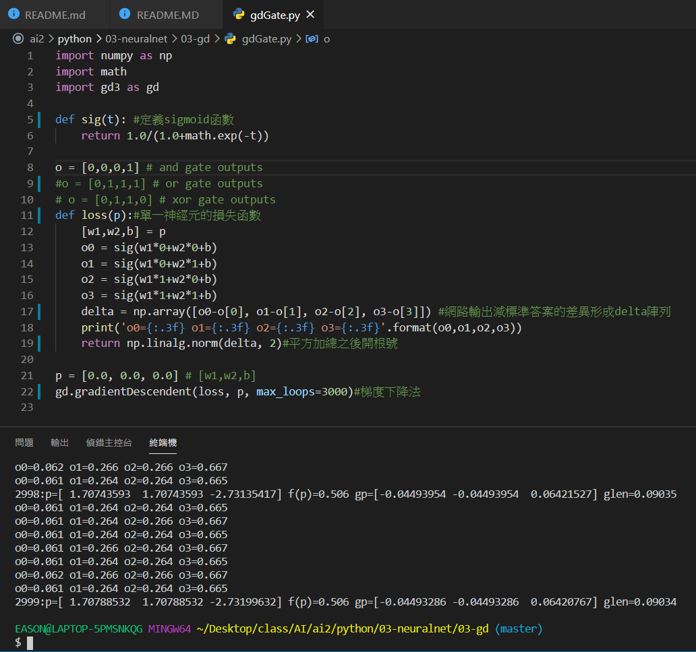
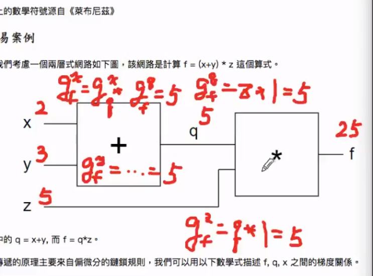

# 人工神經網路
(以下內容參考自維基百科)

人工神經網路（英語：Artificial Neural Network，ANN），簡稱神經網路（Neural Network，NN）或類神經網路，在機器學習和認知科學領域，是一種模仿生物神經網路（動物的中樞神經系統，特別是大腦）的結構和功能的數學模型或計算模型，用於對函式進行估計或近似。神經網路由大量的人工神經元聯結進行計算。大多數情況下人工神經網路能在外界資訊的基礎上改變內部結構，是一種自適應系統，通俗的講就是具備學習功能。現代神經網路是一種非線性統計性資料建模工具，神經網路通常是通過一個基於數學統計學類型的學習方法（Learning Method）得以最佳化，所以也是數學統計學方法的一種實際應用，通過統計學的標準數學方法我們能夠得到大量的可以用函式來表達的局部結構空間，另一方面在人工智慧學的人工感知領域，我們通過數學統計學的應用可以來做人工感知方面的決定問題（也就是說通過統計學的方法，人工神經網路能夠類似人一樣具有簡單的決定能力和簡單的判斷能力），這種方法比起正式的邏輯學推理演算更具有優勢。

和其他機器學習方法一樣，神經網路已經被用於解決各種各樣的問題，例如機器視覺和語音辨識。這些問題都是很難被傳統基於規則的編程所解決的。
## gdGate.py執行

        最後會PRINT出AND閘的標準輸出
    
## 反傳遞算法

## 參考資料
[神經網路](https://misavo.com/blog/%E9%99%B3%E9%8D%BE%E8%AA%A0/%E6%9B%B8%E7%B1%8D/%E4%BA%BA%E5%B7%A5%E6%99%BA%E6%85%A7/03-%E7%A5%9E%E7%B6%93%E7%B6%B2%E8%B7%AF/A-%E4%BD%95%E8%AC%82%E7%A5%9E%E7%B6%93%E7%B6%B2%E8%B7%AF%EF%BC%9F?fbclid=IwAR269bKrKqojCF4R1nZDtSnKZKmClAuMyT4H6_Mnvq8Y0ysnjZonAw1mTFg)
[歐基里德範數](https://zh.wikipedia.org/wiki/%E8%8C%83%E6%95%B0#%E6%AC%A7%E5%87%A0%E9%87%8C%E5%BE%B7%E8%8C%83%E6%95%B0)
