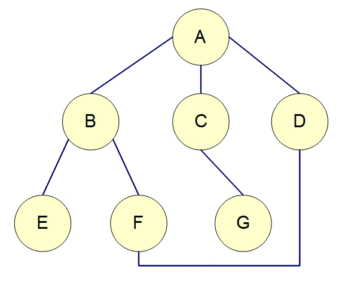

# 深度優先搜尋法(Depth-first Search,DFS)

是一種用來遍尋一個樹(tree)或圖(graph)的演算法。由樹的根(或圖的某一點當成 根)來開始探尋，先探尋邊(edge)上未搜尋的一節點(vertex or node)，並儘可能深的搜索，直到該節點的所有邊上節點都已探尋；就回溯(backtracking)到前一個節點，重覆探尋未搜尋的節點，直到找到目的節點或遍尋全部節點。
(通常以遞迴的方式呈現)

範例: 以深度優先搜尋法找出下圖的所有節點順序:

        假設起始點為 A，且每一節點由左至右的順序來搜尋下個節點，則結果為: A, B, E, F, D, C, G

# 廣度優先搜尋法

是一種圖形(graph)搜索演算法。從圖的某一節點(vertex, node)開始走訪，接著走訪此一節點所有相鄰且未拜訪過的節點，由走訪過的節點繼續進行先廣後深的搜尋。以樹(tree)來說即把同一深度(level)的節點走訪完，再繼續向下一個深度搜尋，直到找到目的節點或遍尋全部節點。
(通常以迴圈的方式呈現)
範例: 廣度優先搜尋法找出下圖的所有節點順序:

        假設起始點為 A，且每一節點由左至右的順序來搜尋下個節點，則結果為: A, B, C, D, E, F, G

## 參考資料
[深度優先搜尋法](http://simonsays-tw.com/web/DFS-BFS/DepthFirstSearch.html) \
[廣度優先搜尋法](http://simonsays-tw.com/web/DFS-BFS/BreadthFirstSearch.html)
