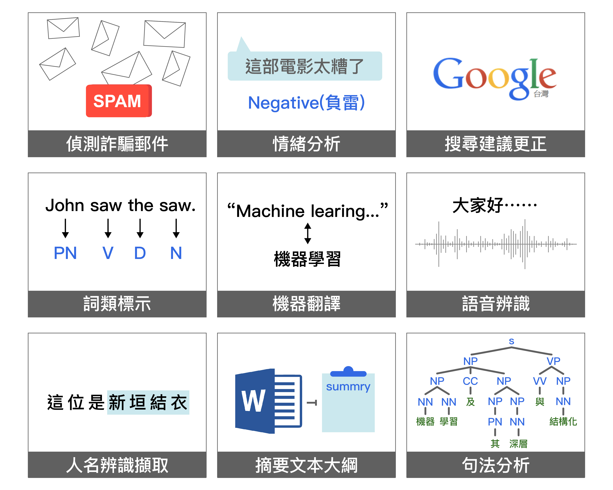

# 自然語言
## 自然語言與程式語言的差別
 [圖片取自](https://research.sinica.edu.tw/nlp-natural-language-processing-chinese-knowledge-information/)
## 自然語言的用途
 [圖片取自](https://research.sinica.edu.tw/nlp-natural-language-processing-chinese-knowledge-information/)

### 作業說明
[習題：請寫一個可以產生文章或語句的程式](https://github.com/yolo310250/ai108b/blob/master/order/order.py)