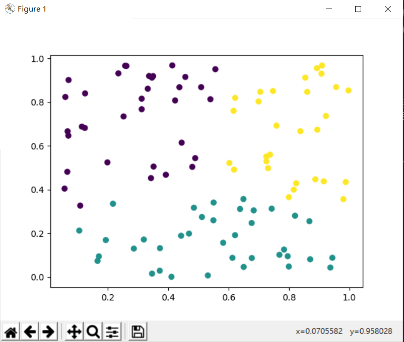

# 模式識別

## K-means 
以下內容參照自[機器學習: 集群分析 K-means Clustering](https://medium.com/@chih.sheng.huang821/%E6%A9%9F%E5%99%A8%E5%AD%B8%E7%BF%92-%E9%9B%86%E7%BE%A4%E5%88%86%E6%9E%90-k-means-clustering-e608a7fe1b43) \

K-means是非監督式學習。主要做的功能是分群。
```
什麼是非監督式學習? 就是你得到的資料你沒有任何Ground truth，你只有資料本身。
```
## kmean.py執行



## 支援向量機(Support Vector Machine)SVM
SVM是一種監督式的學習方法，用統計風險最小化的原則來估計一個分類的超平面(hyperplane)，其基礎的概念非常簡單，就是找到一個決策邊界(decision boundary)讓兩類之間的邊界(margins)最大化，使其可以完美區隔開來。

## svm1.py執行
以下內容參照自[[資料分析&機器學習] 第3.4講：支援向量機(Support Vector Machine)介紹](https://medium.com/jameslearningnote/%E8%B3%87%E6%96%99%E5%88%86%E6%9E%90-%E6%A9%9F%E5%99%A8%E5%AD%B8%E7%BF%92-%E7%AC%AC3-4%E8%AC%9B-%E6%94%AF%E6%8F%B4%E5%90%91%E9%87%8F%E6%A9%9F-support-vector-machine-%E4%BB%8B%E7%B4%B9-9c6c6925856b) \

SVM優點： \
1.切出來的線很漂亮，擁有最大margin的特性 \
2.可以很容易透過更換Kernel，做出非線性的線（非線性的決策邊界）\

SVM缺點：
1.效能較不佳，由於時間複雜度為O(n²)當有超過一萬筆資料時，運算速度會慢上許多